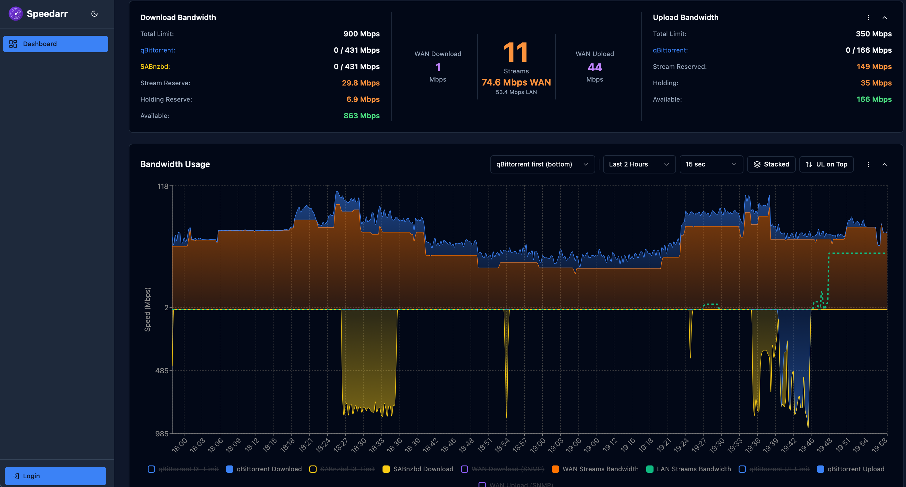

<p align="center">
  
</p>


<p align="center">
  <a href="https://github.com/speedarr/Speedarr/releases/latest"></a>
  <a href="https://hub.docker.com/r/speedarr/speedarr"></a>
</p>

<h3 align="center">Smooth streams first, downloads and seeding with what's left</h3>

<p align="center">
  Speedarr watches what's playing on your Plex, Emby or Jellyfin server, reserves the bandwidth those streams need and gives your download clients the rest, uploads and downloads alike.<br>
  It never touches the streams, only your clients' speed limits, and when the streams stop the limits come off.
</p>

---

<p align="center">
  
</p>

## What it does

- Works with Plex, Emby and Jellyfin — point it at as many servers as you like and their streams all land in the same pool
- Throttles **qBittorrent**, **SABnzbd**, **NZBGet**, **Transmission** and **Deluge**
- Downloads and uploads are handled separately, each with its own total and its own split between clients — the upload split covers the torrent clients, since usenet has nothing to seed
- Demand-aware allocation — unused share moves to the client that is actually using its bandwidth
- Scheduled limits, so peak hours can run on a different total and a different split
- Temporary limits from the dashboard or the API, either for a number of hours or until you clear them
- Holding times by media type, so the bandwidth from a finished stream is still there when the next one starts
- A safety net that leaves an idle client enough room to start a download and show it wants more
- An off switch that hands every client back to unlimited, indefinitely or on a timer
- SNMP polling of your router, so the maths uses what your whole line is doing and not just your clients
- Notifications via Discord/Slack-style webhooks, Pushover, Telegram, Gotify and ntfy
- API keys for automation, with Home Assistant and Unraid recipes in the docs
- A dashboard with bandwidth charts, active streams and stream history, in panels you can reorder and minimise
- Optional login for the dashboard — off by default, and control calls need a key or a session either way

## ⚠️ Disclaimer ⚠️

> **This project is entirely vibe coded using AI (Claude).** While I have found it works well, is actively used and I have thoroughly tested, the codebase has not been manually reviewed line-by-line. Use at your own discretion and please report any issues you encounter.

## How does it work?

Streams come first and your download clients share out whatever is left. That's true in both directions: a stream leaving your house costs you upload, and it costs you a slice of download too, because the player is acknowledging every packet it gets and those ACKs come back in over your download link, where they need room past your downloads. Speedarr polls your media servers and your clients every 5 seconds, works out what the streams need, and hands each client a limit. That's the whole trick: it isn't QoS and it never sits in the path of your traffic. It sets the speed limits in your clients through their own APIs, the same ones you'd set by hand, and keeps changing them as streams start and stop.

How much a stream needs is its bitrate plus protocol overhead, and the default overhead is 100% — double. That's from watching my own server for years: two streams adding up to 21 Mbps sat well under that most of the time but spiked to over double it, and reserving double is what kept them playing smoothly. Lower it or raise it if your line doesn't behave like mine.

The full walkthroughs with numbers are in [How Speedarr works](docs/how-it-works.md).

## Quick Start

### Prerequisites

- A Plex, Emby or Jellyfin server
- At least one download client

### Unraid

1. Open the **Community Applications** (CA) plugin
2. Search for **Speedarr**
3. Click **Install** and apply the default template

The container will be available at **http://[UNRAID-IP]:9494**.

### Docker

1. Download the `docker-compose.yml` file from this repository.
2. Pull the latest image:
```bash
docker compose pull
```

3. Start the container:
```bash
docker compose up -d
```

Open **http://localhost:9494** — the setup wizard will walk you through connecting Plex and your download clients.

> **Tip**: If your services use `.lan` or `.local` hostnames, add `dns: [192.168.1.1]` (your router IP) to the service in `docker-compose.yml`.

### Windows (Docker Desktop)

1. Download and install [Docker Desktop](https://www.docker.com/products/docker-desktop/), default settings are fine
2. Open Docker Desktop **Settings > General** and ensure **Start Docker Desktop when you sign in** is enabled, so Speedarr starts automatically on reboot
3. Open **PowerShell** and run the following commands:

```powershell
mkdir C:\Speedarr
cd C:\Speedarr
curl -o docker-compose.yml https://raw.githubusercontent.com/speedarr/Speedarr/main/docker-compose.yml
docker compose up -d
```

Open **http://localhost:9494** — the setup wizard will walk you through connecting Plex and your download clients.

> **Note**: `C:\Speedarr` is just a suggestion — you can use any folder you like.

### Updating

To update Speedarr, navigate to the folder containing your `docker-compose.yml` and run:

```bash
docker compose pull
docker compose up -d
```

This pulls the latest image and recreates the container. Your data and settings are preserved.

Ports, PUID/PGID, the environment variables and what the wizard asks you for are in [Installing Speedarr](docs/install.md).

## Docs

- [Installing Speedarr](docs/install.md) — Docker, Windows, Unraid, the container's knobs, first run and where to find your tokens.
- [How Speedarr works](docs/how-it-works.md) — what a stream reserves, holding times, how clients share the rest, schedules, the off switch, what happens when things go away.
- [Settings reference](docs/settings.md) — every tab and field, defaults included.
- [API and integrations](docs/api.md) — API keys, the endpoints worth calling, Home Assistant and Unraid recipes.
- [Running it](docs/operations.md) — the data folder, backups, retention, logs, health checks, troubleshooting.

## Support

- [GitHub Issues](https://github.com/speedarr/Speedarr/issues) — Bug reports and feature requests

## Security

To report a security vulnerability, please use [GitHub's private vulnerability reporting](https://github.com/speedarr/Speedarr/security/advisories/new) instead of opening a public issue.

## License

[MIT](LICENSE)
