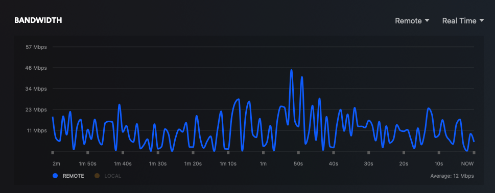

# How Speedarr works

[← Docs index](README.md)

The goal of Speedarr is to help you achieve the following:
- Maximum download speed if you have multiple download clients
- Maximum upload speed for seeding while reserving ample bandwidth for your streams

## The idea

Streams come first, and whatever is left over is shared out between your download clients. That applies in both directions: a stream going out of your house costs you upload, and it costs you a little download too (more on that below), and both get carved out before any client is given a number.

Speedarr works this out by polling. One loop asks your media servers what is playing, another asks your download clients what they are doing, and both run every 5 seconds by default. 5 seconds is also the floor — it's quick enough that a new stream has its bandwidth carved out within a poll or two, and anything faster is just hammering your server's API for no real gain. If you'd rather it was gentler you can take the interval up to 300 seconds in Settings › General, at the cost of Speedarr taking that much longer to notice a stream starting.

## Which streams count

WAN streams always count. LAN streams only count if the server they came from has **Include LAN Streams in Bandwidth** switched on, and that is off by default — a stream to a TV in your lounge never touches your internet line, so throttling your downloads for it would cost you speed and buy you nothing.

Whether a stream is LAN or WAN is decided per server, in this order:

1. The server's **LAN Networks (override)** list, if you have filled it in. Set it and it replaces everything below.
2. For Emby and Jellyfin, the subnets the server itself reports. Speedarr reads those when it starts, and again whenever you save or test that server in Settings, so if you change them on the server, save it again in Settings to pick them up.
3. Otherwise the private IP ranges — RFC1918, loopback, link-local and friends.

On top of that, the server's own verdict wins: if Plex flags a session as local — or Emby or Jellyfin report one as local, which they do less often — Speedarr believes it.

You can point Speedarr at as many media servers as you like, in any mix, and their streams all land in the same pool. Emby and Jellyfin are fully wired up, and the throttling math treats them exactly like Plex. The one real difference is on the dashboard: the measured-bandwidth figure comes from a Plex Pass endpoint that Emby and Jellyfin have no equivalent for, so their streams show a bitrate but no measured throughput.

## How much a stream reserves

In Auto mode — the default — a stream reserves the bitrate your server reports for it, plus protocol overhead. Overhead defaults to 100% and can be set anywhere from 0 to 300%, so out of the box a 10 Mbps stream has 20 Mbps put aside for it. Auto is the default because a phone stream and a 4K remux have no business reserving the same amount.

Sometimes the server won't give up a bitrate at all. In that case Speedarr falls back on the quality it does report:

| What the server reports | Reserved before overhead |
|---|---|
| 4K / 2160p | 40 Mbps |
| 1080p, or anything else flagged HD | 12 Mbps |
| 720p | 6 Mbps |
| Anything else | 4 Mbps |

Manual mode instead reserves a fixed figure for every stream, 15 Mbps by default, whatever the stream actually is. Overhead isn't applied on top of it — the number you typed is the reservation. Worth a look if you'd rather have one predictable number per stream than trust what your server reports.

### Why double the overhead?

Plex have an excellent write-up on **Bitrates and How They Matter** located [here](https://support.plex.tv/articles/227715247-server-settings-bandwidth-and-transcoding-limits/), I would recommend reading this before continuing but I will provide a summary below.

In the below screenshot there are 2 plex streams totalling 21Mbps but as you can see the bandwidth fluctuates greatly. For the most part it's well under the 21Mbps but then with spikes of over double that. After very closely watching my server over the years I found reserving double the bandwidth is sufficient for minimizing buffering. This is why the default protocol overhead in Speedarr is 100%, you can of course lower this or even increase it if you see fit.

## Downloads pay too

A stream isn't a one-way conversation. The player is acknowledging every packet it receives, and if your downloads are allowed to fill the line completely, those TCP ACKs and the rest of the control traffic queue up behind them and the stream stalls anyway. So Speedarr also holds a slice of your download limit back while streams are playing. That is the **Download Bandwidth Reserve %**: 20% by default, taken from the stream figure after overhead, and settable anywhere from 0 to 100%.

With the defaults, a single 10 Mbps stream works out like this:

- 10 Mbps × (1 + 100%) = **20 Mbps** taken off your upload limit
- 20 Mbps × 20% = **4 Mbps** taken off your download limit

## Holding times

The logic behind this feature is that you are likely to start another stream once one ends so Speedarr "holds" this bandwidth until the time specified has been reached, rather than letting your upload clients use this bandwidth. This ensures there is bandwidth already carved out rather than waiting for Speedarr to detect a new stream.

The defaults are 600 s (10 min) after an episode and 1800 s (30 min) after a movie — a movie gets longer because you are more likely to sit through credits, go and make a coffee and come back for another one. Anything that isn't a movie is treated as an episode, music included, so the shorter hold is the one you will normally see.

If the same user on the same player starts playing again while the hold is running, the hold is dropped rather than counted twice on top of the new stream. The download-side reserve is held along with it, at the same 20%, so it winds down as the hold expires.

## Sharing between download clients

### Single usenet client

This really doesn't add much value for you, except maybe graphing the download speeds, you could use it for alternate speed limits but you're probably better off doing this natively. Speedarr will still trim your download limit a little while streams are playing, to keep the download reserve described above.

### Single torrent client

Okay now we're talking, Speedarr can help you! Configure the max download bandwidth you want the torrent client to use and then the max upload bandwidth too, strongly recommend 10-20% lower than your actual internet speed to allow some bandwidth for other devices on your network. For arguments sake let's say you have 100Mbps upload, so you configure 80Mbps in Speedarr, what will happen is: If there are no WAN streams your torrent client will be allowed to upload at 80Mbps, within a few seconds of a plex stream starting Speedarr will then "rate limit" the torrent upload. For example; An 8 Mbps stream with 100% overhead = 16.0 Mbps reserved leaving 64Mbps for torrent upload (80Mbps - 16Mbps). Your download limit drops by 20% of that 16 Mbps as well, so 3.2 Mbps, for the download reserve.

### Multiple clients (all usenet, all torrent or a mix)

Now we're getting into the really cool (in my opinion, and yes I mean mine not Claude). Let's assume a 1000Mbps/100Mbps internet plan. You configure 900Mbps/80Mbps in Speedarr, let's go with qBit and sab and you then set the downloads allocation split of 70/30 for qBit/sab. While the download clients are idle they will evenly split the download bandwidth, Eg 450Mbps/450Mbps. If one download client starts downloading it will get 95% of the configured bandwidth or 855Mbps, this leaves 45Mbps for the other download client to start. Now if a download starts on the other client and both clients are pulling everything they're given, your configured split comes into play: 630Mbps and 270Mbps.

That 45 Mbps is the **Inactive Safety Net %**, 5% by default and settable from 0 to 20. It exists because a client squeezed to nothing can never show you it wants bandwidth — it needs a little room to start a download so Speedarr can see the traffic and hand it its real share.

A client counts as active while it has real traffic, and for up to 30 s after it goes quiet, so a torrent hunting for its next piece or sab finishing a file doesn't lose its share over a lull. Going the other way, a parked client is promoted as soon as it shows a little real traffic — well under its safety-net allowance, since a client held at that allowance can't exceed it and would otherwise never qualify. The exact rule is the lower of 10% of an equal share and 80% of the safety net.

**Minimum Speed per Client** is one figure per direction that applies to every client, 1 Mbps by default, so nothing ever gets squeezed to a complete standstill. Setting it to 0 doesn't mean unlimited: every download client reads a limit of 0 as "no limit at all", so Speedarr floors it at roughly 1 KB/s instead. 0 means a trickle.

## Demand-aware allocation

Clients rarely both want everything at once though, so Speedarr also watches what each client actually uses (demand-aware allocation, on by default). A client that sits under 90% of the limit it was given for three polls in a row — 15 s at the default interval — is treated as slack and held to 1.5x what it is using, never below the safety net, and the rest goes to the client that is saturating its share. A client at or above 90% of its limit for two polls, 10 s, counts as saturated. If qBit is flat out and sab is only pulling 40Mbps, sab is held to 60Mbps and qBit gets 840Mbps. The moment sab fills its 60Mbps it gets its full 270Mbps back within about 10 to 20 seconds, depending on how fast it ramps; taking unused share back takes about 15 seconds. Nothing moves unless something is actually saturating, so a quiet evening leaves the split exactly as you configured it. The same rules apply to upload. You can turn this off in Settings > Bandwidth to hold active clients to their percentages instead. This isn't just limited to 2 clients either, you can have 2 or more and Speedarr will follow the same principles.

The setting only appears once you have two or more clients, because with one there's nowhere for a share to move to.

## Uploads

Only torrent clients take part in the upload side — qBittorrent, Transmission and Deluge. SABnzbd and NZBGet have nothing to seed, so they are pinned to no upload and left out of the split entirely. Everything else works the same way as downloads: the same percentages, the same safety net, the same active detection and the same demand-aware behaviour. There's no separate upload safety-net setting; the upload side reuses the download percentage.

## Scheduled and temporary limits

Each direction can have a schedule of its own: a start and an end time, an alternate total, and an alternate split between clients. Times go in as your browser's local time (they are stored as UTC), and a window that crosses midnight is fine. The schedule only takes over while the window is open and its total is above zero, so leaving the total at 0 is the same as leaving the schedule off.

Temporary limits beat schedules, and schedules beat your normal limits. You can set a temporary limit from the dashboard panel or over the API — leave the duration blank and it stays until you clear it, or give it a number of hours (the API takes up to 168, so 7 days). They are only held in memory, so a restart drops them: [#108](https://github.com/speedarr/Speedarr/issues/108). And while throttling is off they are stored but not enforced.

## Turning throttling off

Turning throttling off doesn't freeze your limits where they are — it hands every client back to its own idea of unlimited, which is 0 for qBittorrent, SABnzbd and NZBGet, "disabled" for Transmission and −1 for Deluge. Speedarr means it: it leaves nothing behind.

You can turn it off indefinitely, for 30 minutes, 1 hour, 2 hours, or a custom period up to 7 days. Polling and the dashboard keep running the whole time, so you still see your streams and your client speeds, Speedarr just doesn't act on them. The state is written to the database before the switch flips, so it survives a restart, and an expiring window comes back on by itself. Re-enabling doesn't restore any particular speed — the next poll simply works out fresh limits from whatever is playing at the time.

## When a server or client goes away

If you run more than one media server and one of them stops answering, its last-known streams are kept for 300 s (5 min) after its last successful poll and then dropped. That way a server rebooting doesn't immediately hand its streams' bandwidth over to your download clients halfway through an episode.

If none of your media servers answer, Speedarr leaves the limits exactly as they are and keeps them there until one comes back. Nothing is restored automatically. This one catches people out, because the Failsafe tab has a "Media Server Timeout" field that looks like it should govern it and does nothing at all: [#102](https://github.com/speedarr/Speedarr/issues/102). If you want your full speeds back while a server is down, turn throttling off.

An "unreachable" notification goes out after about six failed polls in a row, so roughly 30 s at the default interval. Media servers, download clients and SNMP all work to that count, give or take a poll. You get one when it recovers too.

When Speedarr itself stops — a container restart or an update — it applies the shutdown speeds from Settings › Failsafe if you have set them, and otherwise puts every client back to the limit it was on when Speedarr first polled it. The shutdown speeds are deliberately skipped while throttling is off, since being off means hands off. Clients still get put back to their normal speeds in that case — just not the configured shutdown ones.

## SNMP

Your download clients aren't the only thing on your line. Point Speedarr at your router over SNMP and it subtracts what everything *else* on the WAN link is using from what downloads are allowed, so a game update on a desktop or someone's video call isn't bandwidth that gets handed out twice. It takes care to subtract your managed clients' own traffic from the SNMP total first, so they aren't counted against themselves.

You pick one interface, and it's SNMP v2c with a community string only — no v1, no v3. The rate is worked out as an average over a 30 s window rather than by subtracting two readings. Most gateways only refresh their counters every 5 seconds or so, and subtracting two samples that close together aliases against that refresh, sawtoothing the answer between nothing and double the real rate. Shortening the window doesn't fix it either: at 15 s the refresh phase alone still swings it by ±50%. 30 seconds keeps it to a couple of percent.

Any device that speaks standard SNMPv2c IF-MIB counters works — routers, managed switches, pfSense and OPNsense, Mikrotik, a Linux box running snmpd. **Discover Interfaces** will scan and suggest the one it thinks is your WAN, scoring mostly on which interface carries the most traffic plus vendor-neutral keywords like wan, internet, pppoe, external and uplink in the name, with smaller bonuses for UniFi's eth4/eth8 and pfSense/OPNsense's igb*/em* naming. It can still guess wrong, so check it and pick the interface yourself.
